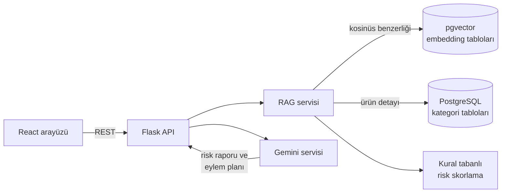

# AI Destekli Satıcı Risk Analiz Sistemi

[](https://github.com/furkancmc/HACKATHON-AI-URUN-RISK-ANALIZI/actions/workflows/ci.yml)


E-ticaret satıcılarının bir ürünü satmaya karar vermeden önce pazar rekabetini, fiyat
konumunu ve müşteri memnuniyetini değerlendirmesini sağlayan, RAG (Retrieval-Augmented
Generation) mimarisine dayalı bir karar destek sistemidir. **BTK Akademi Hackathon 2025**
kapsamında geliştirilmiştir.

## Proje Videosu

[](https://www.youtube.com/watch?v=BdR86g4vPOw)

## Problem ve Çözüm

Pazar yerlerinde yeni bir ürün satmaya başlayan satıcılar; rekabetin yoğunluğunu, doğru
fiyat aralığını ve ürünün müşteri tarafından nasıl karşılandığını genellikle elle yaptıkları
araştırmalarla tahmin etmeye çalışır. Bu süreç hem zaman alır hem de veriye dayanmaz.

Bu proje, Trendyol'dan toplanan telefon, bilgisayar, klima ve kulaklık kategorilerindeki
ürün verisini anlamsal arama ile erişilebilir hale getirir. Her ürün için kural tabanlı bir
risk skoru hesaplar ve bu skoru ürünün tüm verisiyle birlikte Google Gemini'ye bağlam olarak
vererek satıcıya özel, uygulanabilir bir analiz ve eylem planı üretir.

## Özellikler

### Ürün Risk Arama
- Satıcının doğal dille yazdığı sorguya ("sessiz çalışan inverter klima" gibi) anlamsal
  olarak en yakın ürünleri tüm kategorilerde bulur.
- Fiyat aralığı, minimum müşteri puanı ve marka filtreleri sunar.
- Her sonuç için benzerlik oranı ve genel risk skoru gösterilir.
- Ürün detay ekranında rekabet konumu, kârlılık, pazarlama ve müşteri stratejisi,
  operasyon ve lojistik bilgileri ile SEO uyumlu anahtar kelimeler tematik kartlarda sunulur.

### Detaylı Risk Analizi
- Fiyat, müşteri puanı ve rekabet yoğunluğuna dayalı 0-10 aralığında risk skorları hesaplanır.
- Gemini, skorları ve ürün verisini yorumlayarak satış potansiyeli, fiyatlandırma ve rekabet
  stratejisi, kritik riskler, kârlılık ve pazarlama önerilerinden oluşan bir rapor üretir.
- Rapor; **acil eylemler**, **bu ay yapılacaklar** ve **uzun vadeli stratejiler** olarak
  gruplanmış yapılandırılmış bir eylem planıyla tamamlanır.

### Satış Dashboard
- Kategori bazında ürün sayısı, ortalama fiyat ve ortalama puan.
- Kategorilerin ürün dağılımı grafikleri ve embedding kapsama oranları.
- Kategorilere göre en yüksek fiyatlı ürünler ve hızlı risk skorları.

### AI Satış Danışmanı
- Satıcı, aklındaki ürünü doğrudan sorar: ürünle nasıl fark yaratabileceği, müşteri
  yorumlarına göre hangi noktalarda iyileştirme yapabileceği gibi.
- Soruyla en ilgili ürünler veritabanından bulunur ve yanıt bu ürünlerin gerçek verisine
  dayanarak üretilir.

## Mimari



1. Ürün metinleri çok dilli bir Sentence Transformers modeliyle vektöre dönüştürülüp
   pgvector'da saklanır.
2. Satıcının sorgusu aynı modelle vektörleştirilir ve kosinüs benzerliği ile en yakın
   ürünler bulunur.
3. Bulunan ürünlerin tüm verisi ve risk skorları Gemini'ye bağlam olarak verilir.
4. Gemini satıcıya yönelik rapor, yapılandırılmış eylem planı veya sohbet yanıtı üretir.

Veri hazırlama süreci, bileşenler ve risk formülleri için: [docs/architecture.md](docs/architecture.md)

## Teknolojiler

| Katman | Teknoloji |
|---|---|
| Backend | Python 3.11, Flask, Gunicorn |
| Veritabanı | PostgreSQL, pgvector (HNSW indeksli kosinüs araması) |
| Embedding | Sentence Transformers (`paraphrase-multilingual-MiniLM-L12-v2`, 384 boyut) |
| Üretken yapay zeka | Google Gemini (`google-genai` SDK, yapılandırılmış JSON çıktı) |
| Frontend | React 18, Ant Design 5, Recharts, Axios |
| Altyapı | Docker, Docker Compose, Nginx, GitHub Actions |
| Test ve kalite | Pytest, Ruff |

## Proje Yapısı

```
.
├── backend/
│   ├── app.py                    # Flask uygulama fabrikası ve giriş noktası
│   ├── config.py                 # Ortam değişkenlerinden yapılandırma
│   ├── db.py                     # Bağlantı yönetimi ve şema yardımcıları
│   ├── routes.py                 # REST API endpoint'leri
│   ├── serialization.py          # Veritabanı tiplerinin JSON dönüşümü
│   ├── services/
│   │   ├── rag_service.py        # Anlamsal arama, filtreleme, ürün ve dashboard verisi
│   │   ├── risk_scoring.py       # Kural tabanlı risk skorlama
│   │   ├── gemini_service.py     # Gemini entegrasyonu
│   │   ├── prompts.py            # Sistem talimatları ve bağlam şablonları
│   │   ├── embedding_service.py  # Metin vektörleştirme
│   │   └── embedding_indexer.py  # Embedding tablolarının üretimi
│   ├── scripts/
│   │   └── create_embeddings.py  # Embedding üretimi için komut satırı aracı
│   ├── tests/                    # Birim ve API testleri
│   ├── Dockerfile
│   └── requirements.txt
├── frontend/
│   ├── src/
│   │   ├── pages/                # Arama, Dashboard, AI Danışman, Sistem Yönetimi
│   │   ├── components/           # Ürün detay ve risk analizi modalları
│   │   ├── services/api.js       # Backend API istemcisi
│   │   ├── utils/                # Biçimlendirme ve analiz raporu ayrıştırma
│   │   └── constants/            # Alan adlarının Türkçe karşılıkları
│   ├── Dockerfile
│   └── nginx.conf
├── database/
│   └── schema.sql                # Kategori tabloları ve pgvector kurulumu
├── docs/
│   ├── architecture.md           # Mimari ve risk skorlama yöntemi
│   └── api.md                    # API referansı
├── docker-compose.yml
└── .env.example
```

## API

| Metot | Endpoint | Açıklama |
|---|---|---|
| GET | `/api/health` | Servis durumu |
| POST | `/api/search` | Filtreli anlamsal ürün arama ve risk skorları |
| GET | `/api/product/<id>/details` | Ürünün tüm verisi ve risk analizi |
| POST | `/api/ai/analyze` | Gemini ile risk raporu ve eylem planı |
| POST | `/api/ai/chat` | Ürün verisine dayalı satış danışmanı sohbeti |
| GET | `/api/tables/stats` | Kategori istatistikleri |
| GET | `/api/dashboard/sales-data` | Dashboard ürün listesi |
| GET | `/api/brands` | Marka listesi |
| POST | `/api/embeddings/create` | Eksik embedding'leri arka planda üretir |

İstek ve yanıt örnekleri: [docs/api.md](docs/api.md)

## Kurulum

> Hackathon sırasında kullanılan ürün veri seti bu repoya dahil değildir. Veritabanı şeması
> `database/schema.sql` dosyasında yer alır.

### Docker ile

```bash
cp .env.example .env          # DB_PASSWORD ve GEMINI_API_KEY değerlerini doldurun
docker compose up --build
```

- Arayüz: http://localhost:3000
- API: http://localhost:5000/api/health

Veritabanına ürün verisi yüklendikten sonra embedding'ler arayüzdeki **Sistem Yönetimi**
sekmesinden veya aşağıdaki komutla üretilir:

```bash
docker compose exec backend python -m scripts.create_embeddings
```

### Manuel

Gereksinimler: Python 3.11, Node.js 20, pgvector eklentili PostgreSQL 15+

```bash
# Veritabanı
psql -U postgres -c "CREATE DATABASE urun_risk_analiz"
psql -U postgres -d urun_risk_analiz -f database/schema.sql

# Backend
cp .env.example .env
cd backend
python -m venv .venv
source .venv/bin/activate      # Windows: .venv\Scripts\activate
pip install -r requirements.txt
python -m scripts.create_embeddings
python app.py

# Frontend (ayrı terminalde)
cd frontend
npm install
npm start
```

## Testler

```bash
cd backend
pip install -r requirements-dev.txt
ruff check .
pytest
```

Testler veritabanı ve Gemini bağlantısı gerektirmez; servisler sahte nesnelerle (mock)
değiştirilerek API davranışı, risk skorlama kuralları, embedding dokümanı oluşturma ve
prompt bağlamı doğrulanır. Her push'ta GitHub Actions üzerinde lint, test, frontend build
ve Docker imaj build adımları çalışır.

## Ekip

| İsim | Rol | Bağlantılar |
|---|---|---|
| Furkan Camcıoğlu | Backend, veri ve yapay zeka katmanı | [GitHub](https://github.com/furkancmc) · [LinkedIn](https://www.linkedin.com/in/furkan-camcıoğlu-972a22378) |
| Muhammed Akay | Frontend | [LinkedIn](https://www.linkedin.com/in/muhammed-akay-aa21b7331) |

İletişim: furkancamcioglu@outlook.com.tr

## Lisans

Bu proje [MIT Lisansı](LICENSE) ile lisanslanmıştır.
