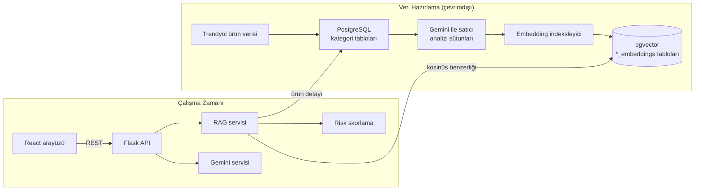

# Mimari

Bu belge, sistemin veri akışını, bileşenlerini ve risk skorlama yöntemini açıklar.

## Genel Bakış

## Veri Hazırlama

1. **Veri toplama:** Telefon, bilgisayar, klima ve kulaklık kategorilerinde Trendyol
   ürünleri toplanmıştır. Her kategori ayrı bir PostgreSQL tablosunda tutulur
   (`database/schema.sql`). Ham veri seti ve toplama araçları bu repoya dahil değildir.
2. **Satıcı analizi:** Her ürün için kârlılık, rekabet konumu, pazarlama açısı, hedef
   müşteri, operasyon tavsiyeleri ve SEO anahtar kelimeleri gibi metinsel analizler
   Gemini ile üretilip ürün tablosuna sütun olarak eklenmiştir. Bu alanlar arayüzdeki
   "Detayları Gör" ekranında gösterilir.
3. **Vektörleştirme:** `backend/scripts/create_embeddings.py`, her ürünün ad, marka,
   açıklama ve analiz sütunlarını tek bir dokümanda birleştirir, çok dilli
   Sentence Transformers modeliyle 384 boyutlu vektöre dönüştürür ve
   `<kategori>_embeddings` tablosuna yazar. Bu tablolarda HNSW indeksi kullanılır.

## Çalışma Zamanı Bileşenleri

| Bileşen | Dosya | Görev |
|---|---|---|
| API katmanı | `backend/routes.py` | Endpoint'ler, doğrulama, hata yönetimi |
| RAG servisi | `backend/services/rag_service.py` | Anlamsal arama, filtreleme, ürün detayı, dashboard verileri |
| Risk skorlama | `backend/services/risk_scoring.py` | Kural tabanlı risk skorları |
| Gemini servisi | `backend/services/gemini_service.py` | Risk raporu, yapılandırılmış eylem planı, sohbet |
| Prompt şablonları | `backend/services/prompts.py` | Sistem talimatları ve ürün bağlamı |
| Embedding servisi | `backend/services/embedding_service.py` | Metin vektörleştirme |
| Embedding indeksleyici | `backend/services/embedding_indexer.py` | Eksik vektörlerin üretilmesi |

### Anlamsal Arama (Retrieval)

1. Kullanıcı sorgusu, ürünlerle aynı embedding modeliyle vektöre dönüştürülür.
2. Her kategorinin embedding tablosunda pgvector kosinüs mesafesi (`<=>`) ile en yakın
   kayıtlar bulunur.
3. Sonuçlar tüm kategoriler arasında benzerliğe göre sıralanır.
4. Her sonuç için ürünün kaynak tablodaki tüm alanları okunur, risk skorları hesaplanır
   ve fiyat, puan ve marka filtreleri uygulanır.

### Yapay Zeka ile Risk Analizi (Generation)

"Risk Analizi" butonu ürünün tüm verisini ve kural tabanlı risk skorlarını bağlam
olarak Gemini'ye iletir. İki çıktı üretilir:

- **Risk raporu:** Satış potansiyeli, fiyatlandırma ve rekabet, kritik riskler,
  kârlılık, pazarlama ve SEO önerileri ile satıcı kararından oluşan Markdown rapor.
  Arayüz raporu başlıklarına göre ayrı kartlara böler.
- **Eylem planı:** JSON şemasıyla zorunlu kılınmış yapılandırılmış çıktı:
  acil eylemler, bu ay yapılacaklar ve uzun vadeli stratejiler.

**AI Satış Danışmanı** sohbetinde ise kullanıcının sorusuyla en ilgili beş ürün
anlamsal arama ile bulunur ve bu ürünlerin verileri yanıtın bağlamına eklenir.

## Risk Skorlama Yöntemi

Tüm skorlar 0-10 aralığındadır; yüksek değer yüksek risk anlamına gelir. Veri eksik
olduğunda nötr değer (5.0) kullanılır.

| Bileşen | Kural |
|---|---|
| Fiyat riski | Kategori ortalamasının %150 üstü: 8, %120 üstü: 6, %80 altı: 4, ortalama civarı: 3 |
| Puan riski | 4.5 ve üzeri: 2, 4.0 ve üzeri: 3, 3.5 ve üzeri: 5, 3.0 ve üzeri: 7, altı: 9 |
| Rekabet riski | Kategorideki aynı marka ürün sayısı 50'den fazla: 8, 20'den fazla: 6, 10'dan fazla: 4, diğer: 2 |

Genel risk, üç bileşenin ortalamasıdır ve aşağıdaki seviyelere ayrılır:

| Genel risk | Seviye | Satıcı önerisi |
|---|---|---|
| 7 ve üzeri | Yüksek risk | Satış önerilmez |
| 5 - 7 | Orta risk | Dikkatli satış |
| 3 - 5 | Düşük risk | Satış yapılabilir |
| 3 altı | Çok düşük risk | Önerilen ürün |

## Güvenlik Notları

- Tablo adları SQL sorgularına yalnızca `psycopg2.sql.Identifier` ile eklenir ve
  dışarıdan gelen `source_table` değeri mevcut kategori tablolarıyla doğrulanır.
- Veritabanı ve API anahtarları yalnızca ortam değişkenlerinden okunur; `.env`
  dosyası repoya eklenmez.
